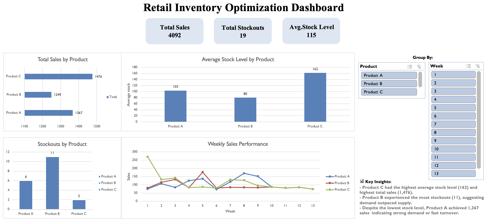

# 🛒 Retail Inventory Optimization Dashboard (Excel Project)

Analyzing inventory and sales trends for Products A, B, and C over a 90-day retail period. This project explores stockout risks, restocking patterns, and optimization strategies using Microsoft Excel, pivot analysis, and interactive dashboarding.

---

## 📊 Project Overview

Retail businesses constantly face the challenge of maintaining optimal inventory levels too much stock increases storage costs, while too little causes missed sales and unhappy customers. This project analyzes daily sales, stock levels, and restocking behavior across three products to support better inventory decision-making.

---

## 🎯 Business Goals

- Analyze daily stock, restocks, and sales by product
- Detect stockout risks and understocking trends
- Optimize restock timing using 7-day average sales
- Recommend actionable improvements to reduce waste and improve availability

---

## 🗂️ Dataset Summary

The dataset simulates 3 months of operations for 3 products (A, B, and C) stored across different warehouses.

| Column           | Description                                |
|------------------|--------------------------------------------|
| `Date`           | Daily record of sales activity             |
| `Product`        | Product category (A, B, or C)              |
| `Warehouse`      | Fulfillment center (North, South, East)    |
| `Sales`          | Number of units sold                       |
| `Stock_Level`    | Inventory remaining at end of day          |
| `Restock_Amount` | Units added into stock (if any)            |
| `Stockout_Flag`  | Custom flag when stock < 10                |
| `7_day_avg_sales`| Rolling 7-day average sales (for trends)   |

---

## 💻 Tools Used

- Microsoft Excel (PivotTables, slicers, charts)
- Manual data cleaning and calculated columns
- PowerPoint (for annotated dashboard visuals)

---

## 🧼 Step 1: Data Cleaning

- Formatted dates to dd/mm/yyyy
- Removed duplicate entries
- Verified numeric columns (Sales, Stock_Level)
- Created `Stockout_Flag` with: `=IF([@[Stock_Level]]<10, "Yes", "No")`
- Calculated `7_day_avg_sales` using rolling averages
- Added `Week` grouping: `=WEEKNUM([@Date])`

---

## 🔍 Step 2: Exploratory Data Analysis (EDA)

Used PivotTables and Excel formulas to analyze:

- 📦 Total Sales by Product
- 📉 Average Stock Level by Product
- 🔁 Restock Frequency per Product
- ⚠️ Stockouts by Product and Week

### Charts Created:

- **Bar Chart:** Total Sales by Product
- **Line Graph:** Weekly Sales Trends
- **Pie Chart:** Stockouts by Product
- **Column Chart:** Average Stock Levels
- **Slicers:** Interactive filters for Product and Week

---

## 📌 Step 3: Key Insights

### ✅ Product C
- Highest average stock level (162 units)
- Highest total sales (1,476 units)
- Stock levels are high, but justified by demand

### ⚠️ Product B
- Most stockout days (11 days)
- Current restocking pace is not meeting demand

### 🔄 Product A
- High sales (1,367 units) with lowest average stock (103 units)
- Indicates fast turnover and a need for closer monitoring

---

## 📈 Step 4: Dashboard

Built a clean and interactive dashboard featuring:

- **Top KPIs:** Total Sales, Avg. Stock Level, Stockout Days
- Weekly sales trend line graph
- Stockouts pie chart
- Product sales and stock level bar charts
- Fully functional slicers by Product and Week

📸 **Dashboard Preview**

> 

---

## 📌 Step 5: Business Recommendations 

**Product B – Frequent Stockouts (11 days)**  
- **Problem:** Current restock frequency/amount isn’t keeping pace with demand.  
- **Recommendation:** Increase restock frequency from once per week to every 4–5 days, or raise restock amounts by 20%.  
- **Impact:** Would reduce lost sales opportunities, with projected sales increase of **8–10% monthly** based on observed stockout patterns.  

**Product C – Overstocking**  
- **Problem:** Highest average stock level (162 units) with lower turnover, creating excess holding costs.  
- **Recommendation:** Reduce safety stock levels by 25–30%, aligning with actual 7-day rolling demand.  
- **Impact:** Could save **£500–£700 per month** in unnecessary storage/holding costs without affecting product availability.  

**Product A – Fast Turnover, Low Stock**  
- **Problem:** Strong sales (1,367 units) but lowest stock levels (103 units average). Risk of sudden stockouts.  
- **Recommendation:** Implement a **low-stock alert system** tied to 7-day average sales velocity. Trigger restocks when stock falls below 20 units.  
- **Impact:** Prevents lost revenue on a high-demand product, projected to **protect £1,000+ monthly sales**.  

**All Products – Automated Restocking**  
- **Problem:** Manual restocking decisions are inefficient and reactive.  
- **Recommendation:** Automate restocking triggers using rolling 7-day sales averages and thresholds. Link to inventory systems for predictive ordering.  
- **Impact:** Reduces manual effort, cuts response lag, and improves availability across all SKUs. Long-term, this can **lower operational costs by 15–20%**.  

## 📂 Files Included

- `retail_inventory_project.xlsx` – cleaned data + dashboard
- `dashboard.png` – Excel dashboard visual
- `README.md` – full write-up

---

